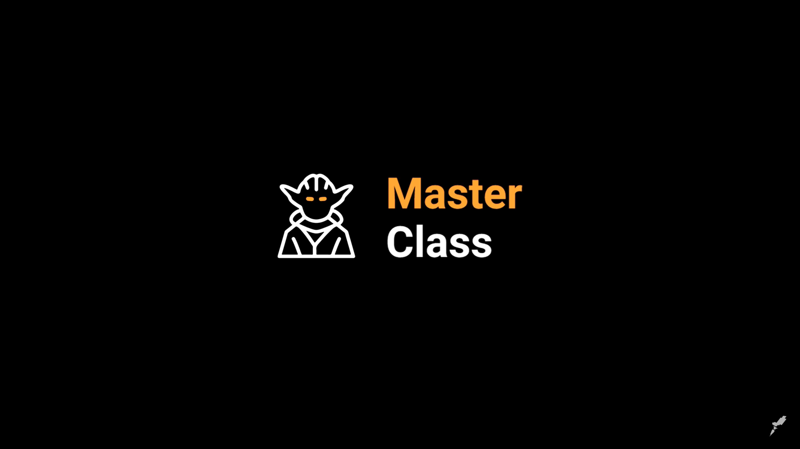

# Repositório das aulas do Masterclass Rocketseat

> Manipulação de DOM com JavaScript, do zero, na prática | Masterclass #18

Nessa aula aprendemos como usar e manipular a DOM (Document Object Model) criando um piano virtual

## 🛠 Tecnologias

- HTML
- CSS & SCSS 
- JavaScript

[Master Class - Manipulação de DOM](https://www.youtube.com/watch?v=UftSB4DaRU4)

---
